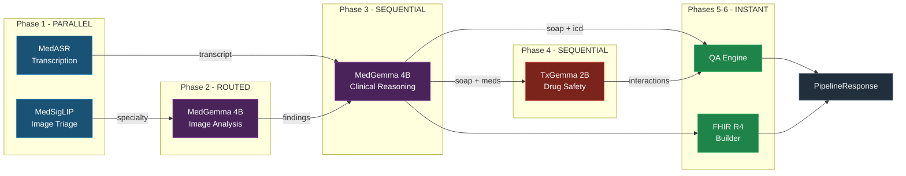

# MedScribe AI

**Multi-Agent Clinical Documentation via Orchestrated HAI-DEF Foundation Models**

[](https://creativecommons.org/licenses/by/4.0/)
[](https://www.python.org/downloads/)
[](https://developers.google.com/health-ai-developer-foundations)

MedScribe AI orchestrates five HAI-DEF foundation models (MedGemma, MedASR, MedSigLIP, TxGemma) as six independent agents in a fault-tolerant clinical documentation pipeline. Transforms raw clinical encounters (audio + images) into structured FHIR R4-compliant medical records with pharmacological safety verification.

**[Competition Writeup](docs/writeup.md)** | **[Live Demo](https://medscribbe.vercel.app/)** | **[API Backend](https://steeltroops-ai-med-gemma.hf.space/health)**

---

## Architecture

> **[Full Architecture Document (C4 Model, 13 sections, 12 diagrams)](docs/ARCHITECTURE.md)**



## HAI-DEF Models Used

| Model                                                                               | Agent                               | Clinical Function                               |
| ----------------------------------------------------------------------------------- | ----------------------------------- | ----------------------------------------------- |
| [`google/medasr`](https://huggingface.co/google/medasr)                             | Transcription                       | Medical-domain speech recognition               |
| [`google/medsiglip-448`](https://huggingface.co/google/medsiglip-448)               | Image Triage                        | Zero-shot specialty classification and routing  |
| [`google/medgemma-4b-it`](https://huggingface.co/google/medgemma-4b-it)             | Image Analysis + Clinical Reasoning | Multimodal medical analysis, SOAP notes, ICD-10 |
| [`google/medgemma-27b-text-it`](https://huggingface.co/google/medgemma-27b-text-it) | Clinical Reasoning (large)          | Complex case clinical reasoning                 |
| [`google/txgemma-2b-predict`](https://huggingface.co/google/txgemma-2b-predict)     | Drug Interaction                    | Drug-drug interaction safety verification       |

## Fine-tuned Adapter

- [`steeltroops-ai/medgemma-4b-soap-lora`](https://huggingface.co/steeltroops-ai/medgemma-4b-soap-lora) -- Built on MedGemma 4B IT, LoRA r=16, 50 clinical SOAP pairs

## Performance

| Metric                                | Value                    |
| ------------------------------------- | ------------------------ |
| Mean end-to-end latency               | ~14s                     |
| Phase 1 parallel speedup              | 1.65x vs sequential      |
| Infrastructure cost                   | $0 (HF Spaces free tier) |
| Production cost at 10K encounters/day | ~$180/day (GCP A100)     |

## Reproducibility

```bash
# Full reproduction from zero
git clone https://github.com/steeltroops-ai/med-gemma.git
cd med-gemma
uv venv && source .venv/bin/activate
uv pip install -r requirements.txt
cp .env.example .env           # Add HF_TOKEN=your_token_here
python -m pytest tests/ -v     # Run evaluation suite (15 tests, 10 clinical scenarios)
uvicorn src.api.main:app --reload --port 7860
# -> http://localhost:7860
```

## API Endpoints

```text
GET  /health              -- Backend status and inference tier
GET  /api/status          -- Detailed model and configuration info
GET  /api/telemetry       -- Per-agent execution stats and failure rates
POST /api/transcribe      -- Audio -> Text (MedASR agent)
POST /api/analyze-image   -- Image -> Findings (MedGemma agent)
POST /api/generate-notes  -- Text -> SOAP + ICD-10 (Clinical agent)
POST /api/full-pipeline   -- Full 6-phase agentic pipeline
POST /api/export/fhir     -- Clinical data -> FHIR R4 Bundle
```

## Project Structure

```text
med-gemma/
  src/
    agents/
      base.py                  # BaseAgent ABC: lifecycle, timing, error handling
      transcription_agent.py   # MedASR agent
      triage_agent.py          # MedSigLIP image triage agent
      image_agent.py           # MedGemma 4B image analysis agent
      clinical_agent.py        # MedGemma clinical reasoning agent
      drug_agent.py            # TxGemma drug interaction agent
      qa_agent.py              # QA rules engine agent
      orchestrator.py          # ClinicalOrchestrator: 6-phase pipeline
    api/
      main.py                  # FastAPI backend
    core/
      inference_client.py      # Multi-backend inference (HF API + local GPU)
      config.py                # Configuration
      schemas.py               # Pydantic models
    utils/
      fhir_builder.py          # HL7 FHIR R4 Bundle generation
  frontend/                    # Next.js 15 clinical interface (deployed on Vercel)
  notebooks/
    fine_tuning.ipynb          # LoRA fine-tuning notebook for MedGemma 4B
  tests/
    eval_synthetic.py          # 10-scenario clinical evaluation framework
    eval_results.json          # Latest evaluation results
    test_pipeline.py           # Unit tests for agents and FHIR builder
  docs/
    writeup.md                 # Competition writeup
    ARCHITECTURE.md            # Full C4 architecture document
  video/
    script.md                  # Video script
```

## Inference Architecture

All inference flows through the `InferenceClient` abstraction. Agents are fully agnostic to the serving backend.

| Backend           | Models                                        | Use Case                         |
| ----------------- | --------------------------------------------- | -------------------------------- |
| HF Serverless API | MedGemma 4B IT, MedASR, MedSigLIP, TxGemma 2B | Cloud deployment (HF Spaces)     |
| Local GPU (vLLM)  | MedGemma 4B IT (Q4), TxGemma 2B               | On-premise / air-gapped clinical |
| Demo Fallback     | N/A                                           | Development / CI testing         |

The agent framework abstracts the inference backend. Adding a new backend (Vertex AI, Ollama, ONNX) requires implementing a single adapter function -- zero agent code changes.

## License

CC BY 4.0

## Disclaimer

MedScribe AI is a documentation assistant. It does not diagnose, prescribe, or replace physician judgement. All AI-generated outputs require independent verification by qualified healthcare professionals before clinical use. This system is designed to assist clinical documentation, not to automate clinical decision-making.

Built with [HAI-DEF](https://developers.google.com/health-ai-developer-foundations) models from Google Health AI.
