# MedScribe AI -- System Architecture

> **Classification:** Technical Architecture Document
> **Audience:** Systems architects, ML engineers, clinical informatics engineers

---

## Table of Contents

1. [Design Philosophy](#1-design-philosophy)
2. [System Context (C4 Level 1)](#2-system-context)
3. [Container Architecture (C4 Level 2)](#3-container-architecture)
4. [Agent Component Architecture (C4 Level 3)](#4-agent-component-architecture)
5. [Pipeline Execution Model](#5-pipeline-execution-model)
6. [Inference Tier Architecture](#6-inference-tier-architecture)
7. [Data Flow & Type Contracts](#7-data-flow--type-contracts)
8. [Deployment Topology](#8-deployment-topology)
9. [Fault Tolerance & Degradation Strategy](#9-fault-tolerance--degradation-strategy)
10. [Security & Privacy Architecture](#10-security--privacy-architecture)
11. [Observability & Audit Trail](#11-observability--audit-trail)
12. [FHIR R4 Output Schema](#12-fhir-r4-output-schema)
13. [Extension Points & Future Evolution](#13-extension-points--future-evolution)

---

## 1. Design Philosophy

MedScribe AI is designed around four architectural principles derived from both software systems engineering and clinical AI safety requirements:

**P1 -- Agent Autonomy:** Each HAI-DEF model operates as an independent computational agent with its own lifecycle, error boundary, and fallback strategy. No agent's failure should cascade to another.

**P2 -- Pipeline Composability:** The orchestration layer treats agents as interchangeable units conforming to a typed interface (`BaseAgent` -> `AgentResult`). New agents can be added, removed, or reordered without modifying the orchestrator's core logic.

**P3 -- Inference Abstraction:** Agents are agnostic to the inference backend. The same agent code runs against HF Inference API, Vertex AI, or locally hosted model weights. The `InferenceClient` abstraction layer handles backend selection, retry, and fallback.

**P4 -- Clinical Safety by Design:** All outputs include provenance metadata (which model, which version, processing time, confidence). The QA agent enforces structural validation before any clinical document is emitted. No output is presented as definitive medical advice.

---

## 2. System Context

High-level view of MedScribe AI's position within the clinical ecosystem.

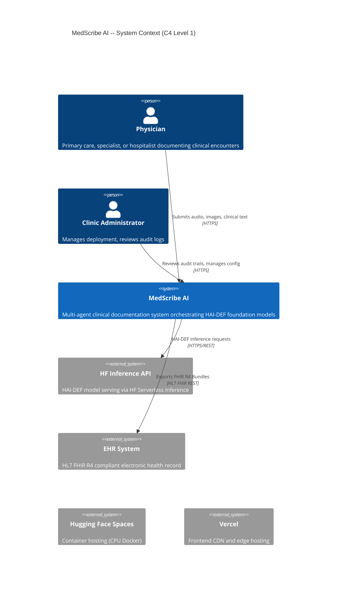

---

## 3. Container Architecture

Decomposition into deployable containers and their communication patterns.

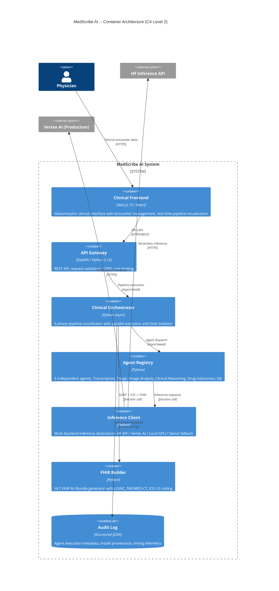

---

## 4. Agent Component Architecture

Detailed component diagram showing the agent type hierarchy and inter-agent relationships.

```mermaid
classDiagram
    class BaseAgent {
        <<abstract>>
        +name: str
        +model_id: str
        +is_ready: bool
        +initialize() void
        +execute(input_data: Any) AgentResult
        #_load_model()* void
        #_process(input_data: Any)* Any
        -_ready: bool
        -logger: Logger
    }

    class TranscriptionAgent {
        +name = "transcription"
        +model_id = "google/medasr"
        #_process(audio_path | text) str
        -_demo_transcript() str
    }

    class TriageAgent {
        +name = "image_triage"
        +model_id = "google/medsiglip-448"
        #_process(PIL.Image) dict
        -SPECIALTY_LABELS: list
        -_demo_triage() dict
    }

    class ImageAnalysisAgent {
        +name = "image_analysis"
        +model_id = "google/medgemma-4b-it"
        #_process(image + specialty) dict
        -SPECIALTY_PROMPTS: dict
        -_demo_findings() dict
    }

    class ClinicalReasoningAgent {
        +name = "clinical_reasoning"
        +model_id = "google/medgemma-4b-it"
        #_process(transcript + findings) dict
        -_build_soap_prompt() str
        -_parse_soap_response() SOAPNote
        -_extract_icd_codes() list
        -_demo_soap() dict
    }

    class DrugInteractionAgent {
        +name = "drug_interaction"
        +model_id = "google/txgemma-2b-predict"
        #_process(soap_text) dict
        -KNOWN_INTERACTIONS: dict
        -_extract_medications() list
        -_rule_based_check() dict
        -_demo_drug_check() dict
    }

    class QAAgent {
        +name = "quality_assurance"
        +model_id = "rules-engine"
        #_process(soap + icd + drugs + fhir) dict
        -_check_soap_completeness() list
        -_check_icd_consistency() list
        -_check_drug_safety() list
        -_check_fhir_validity() list
    }

    class AgentResult {
        +agent_name: str
        +success: bool
        +data: Any
        +error: str | None
        +processing_time_ms: float
        +model_used: str
    }

    class ClinicalOrchestrator {
        +transcription: TranscriptionAgent
        +triage: TriageAgent
        +image_analysis: ImageAnalysisAgent
        +clinical_reasoning: ClinicalReasoningAgent
        +drug_interaction: DrugInteractionAgent
        +qa: QAAgent
        +initialize_all() dict
        +run_full_pipeline() PipelineResponse
        +transcribe() AgentResult
        +triage_image() AgentResult
        +analyze_image() AgentResult
        +generate_clinical_notes() AgentResult
        +check_drugs() AgentResult
        +validate_quality() AgentResult
    }

    BaseAgent <|-- TranscriptionAgent
    BaseAgent <|-- TriageAgent
    BaseAgent <|-- ImageAnalysisAgent
    BaseAgent <|-- ClinicalReasoningAgent
    BaseAgent <|-- DrugInteractionAgent
    BaseAgent <|-- QAAgent
    BaseAgent ..> AgentResult : returns
    ClinicalOrchestrator o-- TranscriptionAgent
    ClinicalOrchestrator o-- TriageAgent
    ClinicalOrchestrator o-- ImageAnalysisAgent
    ClinicalOrchestrator o-- ClinicalReasoningAgent
    ClinicalOrchestrator o-- DrugInteractionAgent
    ClinicalOrchestrator o-- QAAgent
```

---

## 5. Pipeline Execution Model

The six-phase pipeline with parallel/sequential execution semantics, data dependencies, and fault isolation boundaries.

```mermaid
sequenceDiagram
    participant C as Client
    participant O as Orchestrator
    participant T as TranscriptionAgent<br/>(MedASR)
    participant TR as TriageAgent<br/>(MedSigLIP)
    participant IA as ImageAnalysisAgent<br/>(MedGemma 4B)
    participant CR as ClinicalReasoningAgent<br/>(MedGemma 4B)
    participant DI as DrugInteractionAgent<br/>(TxGemma 2B)
    participant QA as QAAgent<br/>(Rules Engine)
    participant FB as FHIRBuilder

    C->>O: run_full_pipeline(audio, image, text)

    rect rgb(40, 60, 80)
        Note over T,TR: Phase 1: INTAKE [PARALLEL via asyncio.gather]
        par Parallel Execution
            O->>+T: execute(audio_path | text)
            T-->>-O: AgentResult{transcript}
        and
            O->>+TR: execute(image)
            TR-->>-O: AgentResult{specialty, confidence}
        end
    end

    rect rgb(50, 50, 70)
        Note over IA: Phase 2: SPECIALTY ANALYSIS [ROUTED]
        O->>O: Route by triage.specialty
        O->>+IA: execute(image, detected_specialty)
        IA-->>-O: AgentResult{findings, structured_report}
    end

    rect rgb(60, 40, 70)
        Note over CR: Phase 3: CLINICAL REASONING [SEQUENTIAL]
        O->>+CR: execute(transcript + image_findings)
        CR-->>-O: AgentResult{soap_note, icd_codes}
    end

    rect rgb(70, 40, 50)
        Note over DI: Phase 4: DRUG SAFETY [SEQUENTIAL]
        O->>+DI: execute(extracted_medications)
        DI-->>-O: AgentResult{interactions, severity}
    end

    rect rgb(50, 60, 50)
        Note over QA,FB: Phases 5-6: VALIDATION + ASSEMBLY [INSTANT]
        O->>+FB: create_full_bundle(soap, icd, findings)
        FB-->>-O: FHIR R4 Bundle
        O->>+QA: execute(soap, icd, drugs, fhir)
        QA-->>-O: AgentResult{checks[], overall_status}
    end

    O-->>C: PipelineResponse{transcript, findings, soap, icd, fhir, drugs, qa, metadata[]}
```

### Phase Execution Semantics

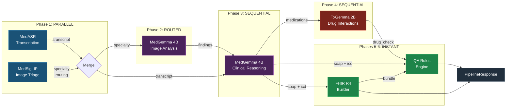

---

## 6. Inference Tier Architecture

The inference client implements a priority-ordered fallback chain, abstracting the model backend from agent logic.

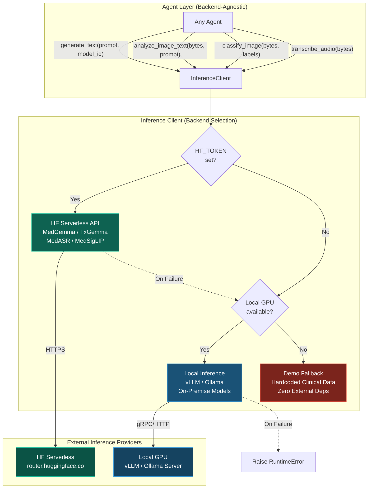

### Tier Comparison Matrix

| Property                   | HF Serverless API       | Local GPU (vLLM/Ollama)      | Demo Fallback     |
| -------------------------- | ----------------------- | ---------------------------- | ----------------- |
| **Model**                  | `google/medgemma-4b-it` | `google/medgemma-4b-it` (Q4) | N/A (hardcoded)   |
| **Cost**                   | Free / Pay-per-use      | Hardware cost only           | Free              |
| **Latency**                | 3-15s per request       | 1-5s per request             | <1ms              |
| **Medical Specialisation** | Full (HAI-DEF trained)  | Full (HAI-DEF trained)       | Static            |
| **Availability**           | Provider-dependent      | Self-managed                 | 100%              |
| **Multimodal**             | Yes (model-dependent)   | Yes (with VRAM)              | No                |
| **Privacy**                | Data sent to HF API     | Data stays on-premise        | No external calls |

---

## 7. Data Flow & Type Contracts

Typed data contracts between all system components using Pydantic models.

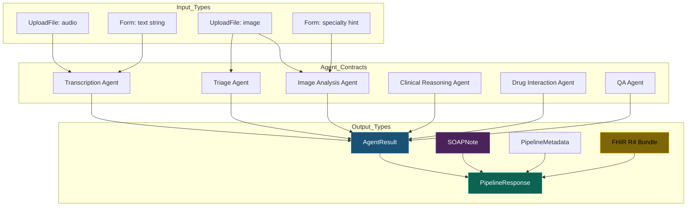

**Agent I/O Contract Details:**

| Agent                  | Input                                 | Output                                           |
| ---------------------- | ------------------------------------- | ------------------------------------------------ |
| TranscriptionAgent     | `str` or audio path                   | `str` (transcript)                               |
| TriageAgent            | `PIL.Image`                           | `{specialty, confidence, scores[]}`              |
| ImageAnalysisAgent     | `{image, specialty, prompt?}`         | `{findings, structured_report}`                  |
| ClinicalReasoningAgent | `{transcript, image_findings?, task}` | `{soap_note: SOAPNote, icd_codes[], raw_output}` |
| DrugInteractionAgent   | `{soap_text, medications[]?}`         | `{medications[], interactions[], risk_level}`    |
| QAAgent                | `{soap, icd, drugs, fhir}`            | `{checks[], score, status}`                      |

---

## 8. Deployment Topology

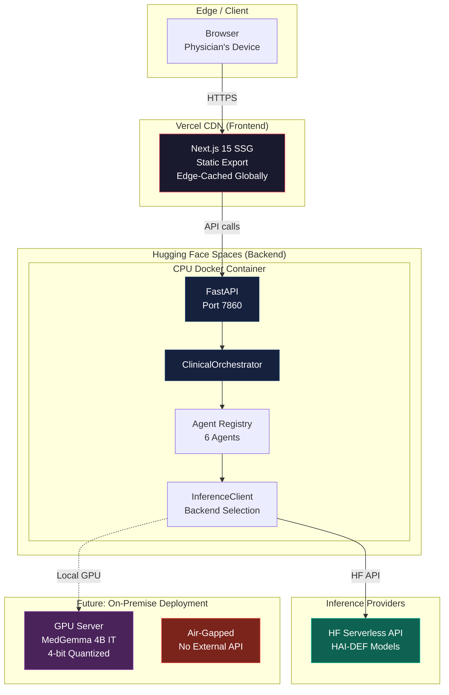

### Resource Profile

| Component           | CPU        | Memory     | Storage  | Cost                |
| ------------------- | ---------- | ---------- | -------- | ------------------- |
| Frontend (Vercel)   | Edge       | 0 (SSG)    | ~5MB     | Free                |
| Backend (HF Spaces) | 2 vCPU     | 512MB      | 1GB      | Free                |
| Inference (HF API)  | HF-managed | HF-managed | 0        | Free (rate-limited) |
| **Total**           | **2 vCPU** | **512MB**  | **~6MB** | **$0/month**        |

---

## 9. Fault Tolerance & Degradation Strategy

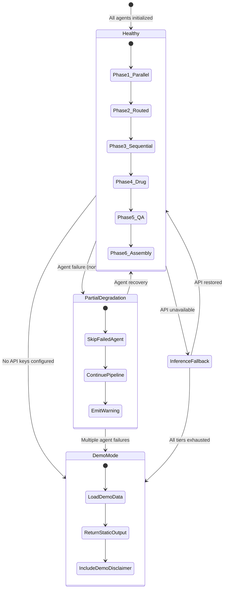

### Agent Failure Isolation Matrix

| Failed Agent           | Impact                | Pipeline Continues?                                     | Degradation                    |
| ---------------------- | --------------------- | ------------------------------------------------------- | ------------------------------ |
| TranscriptionAgent     | No transcript         | YES -- uses `text_input` fallback                       | Text input required            |
| TriageAgent            | No specialty routing  | YES -- defaults to `"general"`                          | Less specific image analysis   |
| ImageAnalysisAgent     | No image findings     | YES -- SOAP generated from transcript only              | No imaging section in report   |
| ClinicalReasoningAgent | No SOAP/ICD           | **PARTIAL** -- pipeline returns transcript + image only | Core output missing            |
| DrugInteractionAgent   | No drug safety check  | YES -- SOAP still generated                             | Safety layer bypassed (logged) |
| QAAgent                | No quality validation | YES -- output emitted without validation                | Unvalidated output (flagged)   |

---

## 10. Security & Privacy Architecture

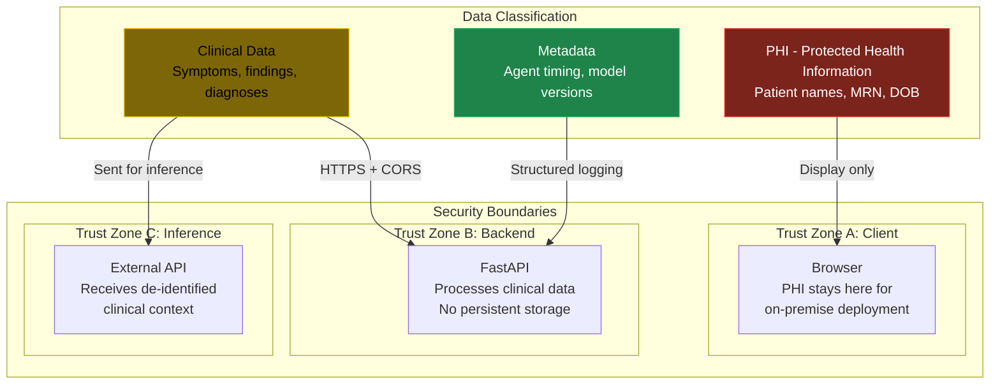

**Privacy Design Decisions:**

1. **No persistent storage:** The backend stores no patient data. Everything is processed in-memory and discarded after response.
2. **CORS-controlled access:** Only the registered frontend origin can call the API.
3. **On-premise deployment path:** For production clinical use, the same codebase runs with locally hosted model weights -- zero data leaves the institution.
4. **Audit without PII:** Execution metadata (timing, model used, success/failure) is logged without clinical content.

---

## 11. Observability & Audit Trail

Every agent execution produces structured metadata captured in `PipelineMetadata`:

```mermaid
graph LR
    subgraph "Per-Agent Telemetry"
        A[Agent Execution] --> T[Timing<br/>processing_time_ms]
        A --> M[Model ID<br/>model_used]
        A --> S[Status<br/>success/failure]
        A --> E[Error<br/>error message | null]
    end

    subgraph "Pipeline-Level Metrics"
        T --> PM[PipelineMetadata[]]
        M --> PM
        S --> PM
        E --> PM
        PM --> TT[total_processing_time_ms]
        PM --> AC[agent_count]
        PM --> FR[failure_rate]
    end

    subgraph "Clinical Governance"
        PM --> AL[Audit Log<br/>Who ran what model<br/>when, with what result]
        PM --> QR[Quality Report<br/>Validation checks<br/>pass/fail per section]
    end

    style AL fill:#1a5276,stroke:#2980b9,color:#fff
    style QR fill:#0e6251,stroke:#1abc9c,color:#fff
```

### Example Audit Trace

```json
{
  "pipeline_metadata": [
    {
      "agent_name": "transcription",
      "model_used": "google/medgemma-4b-it",
      "processing_time_ms": 2340.1,
      "success": true
    },
    {
      "agent_name": "image_triage",
      "model_used": "google/medgemma-4b-it",
      "processing_time_ms": 1890.3,
      "success": true
    },
    {
      "agent_name": "image_analysis",
      "model_used": "google/medgemma-4b-it",
      "processing_time_ms": 3200.7,
      "success": true
    },
    {
      "agent_name": "clinical_reasoning",
      "model_used": "google/medgemma-4b-it",
      "processing_time_ms": 5100.2,
      "success": true
    },
    {
      "agent_name": "drug_interaction",
      "model_used": "google/medgemma-4b-it",
      "processing_time_ms": 2800.5,
      "success": true
    },
    {
      "agent_name": "quality_assurance",
      "model_used": "rules-engine",
      "processing_time_ms": 0.8,
      "success": true
    }
  ],
  "total_processing_time_ms": 15332.6
}
```

---

## 12. FHIR R4 Output Schema

The pipeline produces HL7 FHIR R4-compliant Bundles. Resource structure:

```mermaid
graph TD
    subgraph "FHIR R4 Bundle (type: document)"
        B[Bundle] --> E[Encounter<br/>Visit context<br/>AMB | EMER | IMP]
        B --> C[Composition<br/>SOAP Note Document]
        B --> DR[DiagnosticReport<br/>Imaging Findings]
        B --> COND1[Condition #1<br/>ICD-10 Code]
        B --> COND2[Condition #2<br/>ICD-10 Code]
        B --> CONDN[Condition #N<br/>ICD-10 Code]

        C --> S1[Section: Subjective<br/>LOINC 10164-2]
        C --> S2[Section: Objective<br/>LOINC 10210-3]
        C --> S3[Section: Assessment<br/>LOINC 51848-0]
        C --> S4[Section: Plan<br/>LOINC 18776-5]

        DR --> OBS[Observation<br/>Image findings text]

        COND1 --> ICD[Coding System<br/>http://hl7.org/fhir/sid/icd-10]
    end

    style B fill:#1a5276,stroke:#2980b9,color:#fff
    style C fill:#4a235a,stroke:#8e44ad,color:#fff
    style E fill:#0e6251,stroke:#1abc9c,color:#fff
    style DR fill:#7d6608,stroke:#f1c40f,color:#000
    style COND1 fill:#7b241c,stroke:#e74c3c,color:#fff
```

---

## 13. Extension Points & Future Evolution

### 13.1 Architecture Extension Points

The system is designed with explicit extension points for future capabilities:

```mermaid
graph TD
    subgraph "Current Architecture (v2.1)"
        BA[BaseAgent ABC]
        IC[InferenceClient]
        CO[ClinicalOrchestrator]
        FB[FHIRBuilder]
    end

    subgraph "Extension Point: New Agents"
        BA -.->|extend| PA[PathologyAgent<br/>Path Foundation]
        BA -.->|extend| DA[DermatologyAgent<br/>Derm Foundation]
        BA -.->|extend| RA[RadiologyAgent<br/>CXR Foundation]
        BA -.->|extend| HA[HeARAgent<br/>Bioacoustic Analysis]
        BA -.->|extend| SA[SummarizationAgent<br/>Patient Summary]
    end

    subgraph "Extension Point: New Inference Tiers"
        IC -.->|add tier| VX[Vertex AI<br/>Production GPU]
        IC -.->|add tier| OL[Ollama / vLLM<br/>Local GPU]
        IC -.->|add tier| EG[Edge Runtime<br/>ONNX / TFLite]
    end

    subgraph "Extension Point: New Output Formats"
        FB -.->|extend| CDA[CDA R2<br/>Clinical Document Arch.]
        FB -.->|extend| PDF[PDF Report<br/>Clinical Print Format]
        FB -.->|extend| HL7V2[HL7 v2.x<br/>Legacy EHR Systems]
    end

    subgraph "Extension Point: Pipeline Patterns"
        CO -.->|compose| FP[Feedback Loop<br/>Clinician correction -> retraining]
        CO -.->|compose| BP[Batch Pipeline<br/>Multi-encounter processing]
        CO -.->|compose| SP[Streaming Pipeline<br/>Real-time transcription]
    end

    style PA fill:#4a235a,stroke:#8e44ad,color:#fff
    style DA fill:#4a235a,stroke:#8e44ad,color:#fff
    style RA fill:#4a235a,stroke:#8e44ad,color:#fff
    style VX fill:#0e6251,stroke:#1abc9c,color:#fff
    style OL fill:#0e6251,stroke:#1abc9c,color:#fff
    style EG fill:#0e6251,stroke:#1abc9c,color:#fff
    style CDA fill:#7d6608,stroke:#f1c40f,color:#000
    style PDF fill:#7d6608,stroke:#f1c40f,color:#000
```

### 13.2 Evolutionary Roadmap

| Version            | Capability                              | Architectural Change                            |
| ------------------ | --------------------------------------- | ----------------------------------------------- |
| **v2.1** (current) | 6 agents, 2-tier inference, FHIR R4     | Baseline architecture                           |
| **v3.0**           | Streaming ASR (real-time transcription) | WebSocket transport + streaming agent interface |
| **v3.1**           | Clinician feedback loop                 | Feedback store + LoRA fine-tuning pipeline      |
| **v4.0**           | Multi-encounter session management      | Session state machine + encounter history       |
| **v4.1**           | Edge deployment (mobile / RPi)          | ONNX runtime agent + model distillation         |
| **v5.0**           | Multi-institution federated deployment  | Agent mesh + federated learning coordinator     |

### 13.3 Agent Mesh Vision

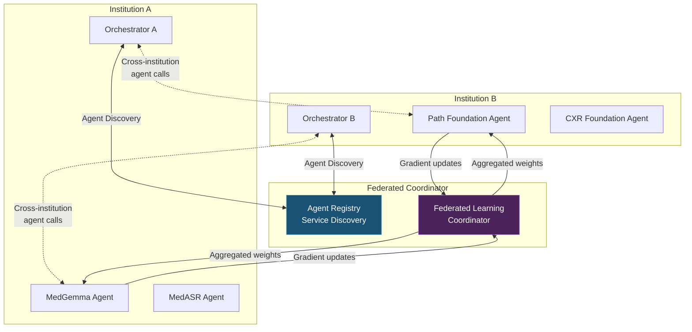

---

## Appendix A: File-to-Architecture Mapping

| File                                | Architectural Role         | Diagram Reference           |
| ----------------------------------- | -------------------------- | --------------------------- |
| `src/agents/base.py`                | BaseAgent ABC              | Section 4: Class Diagram    |
| `src/agents/orchestrator.py`        | ClinicalOrchestrator       | Section 5: Sequence Diagram |
| `src/agents/transcription_agent.py` | MedASR Agent               | Section 4, 5                |
| `src/agents/triage_agent.py`        | MedSigLIP Triage Agent     | Section 4, 5                |
| `src/agents/image_agent.py`         | MedGemma Image Agent       | Section 4, 5                |
| `src/agents/clinical_agent.py`      | MedGemma Clinical Agent    | Section 4, 5                |
| `src/agents/drug_agent.py`          | TxGemma Drug Agent         | Section 4, 5                |
| `src/agents/qa_agent.py`            | QA Rules Agent             | Section 4, 5                |
| `src/core/inference_client.py`      | Inference Tier Abstraction | Section 6                   |
| `src/core/schemas.py`               | Pydantic Type Contracts    | Section 7                   |
| `src/api/main.py`                   | FastAPI Gateway            | Section 3, 8                |
| `src/utils/fhir_builder.py`         | FHIR R4 Builder            | Section 12                  |
| `Dockerfile`                        | Container Definition       | Section 8                   |
| `frontend/`                         | Next.js Clinical UI        | Section 8                   |

---

_This architecture document follows the C4 model (Context, Containers, Components, Code) for progressive detail disclosure. Diagrams are rendered as Mermaid for version-controlled, diff-friendly documentation._
